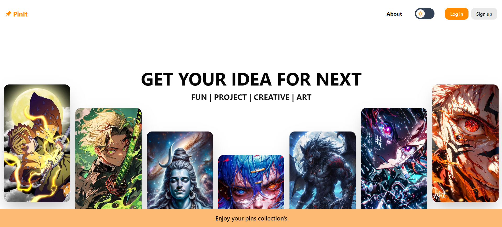
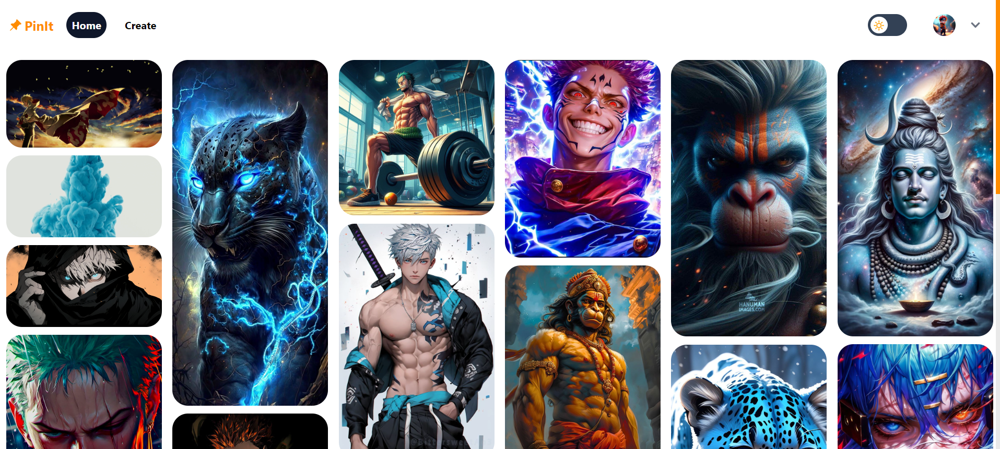

# Pin It

"Pin It" is a full-stack web application built with modern technologies to provide users with a platform for creating, sharing, and discovering visual content.

# Demo Link

- [Demo Link](https://pin-it-by-ayush-mishra.netlify.app/)

# Technology Used
- Frontend
  - Reactjs
  - Redux
  - React Hook form
  - Tailwind Css
  - Yup
  - Typescript
  - Google Login
- Backend
  - Nodejs
  - Express
  - MongoDB
  - Mongoose
  - JWT
  - Bcrypt
  - Cloudinary

